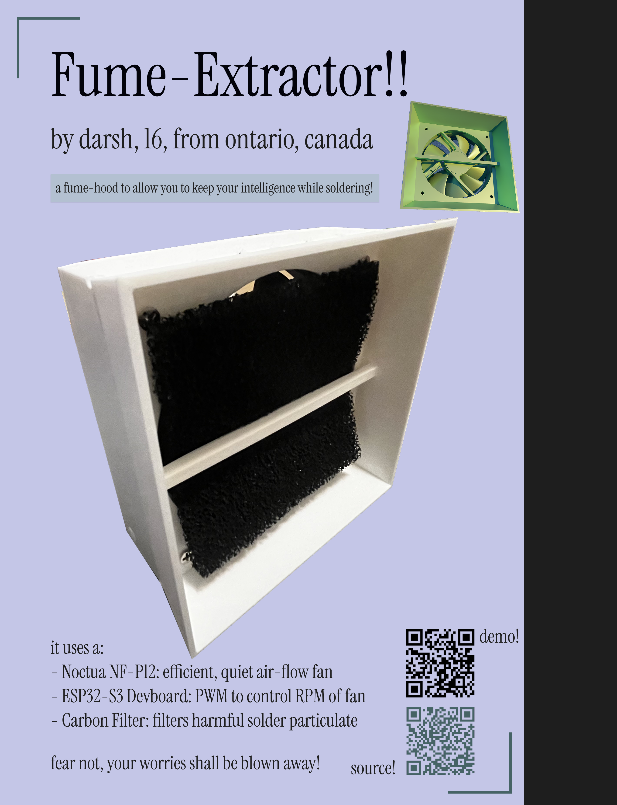
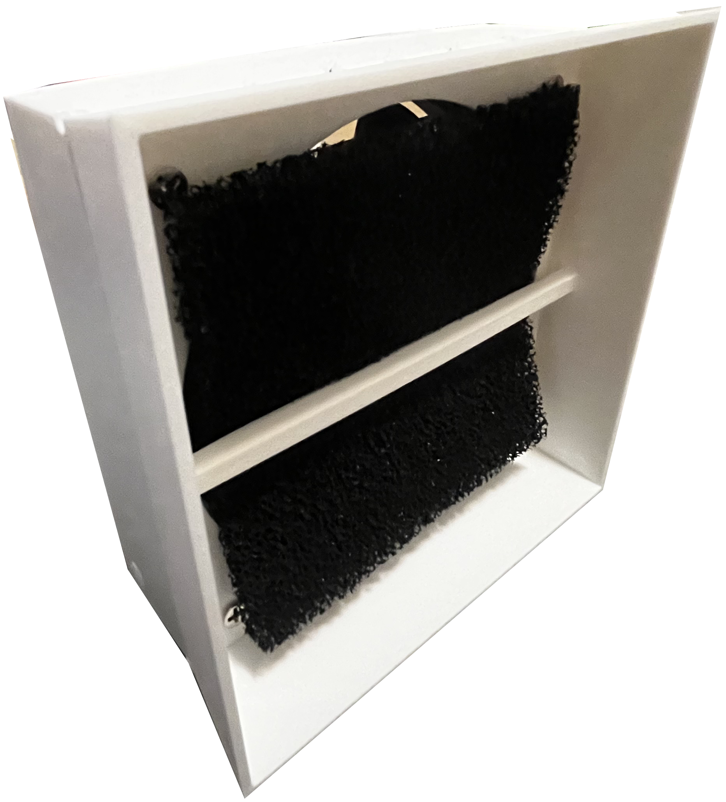
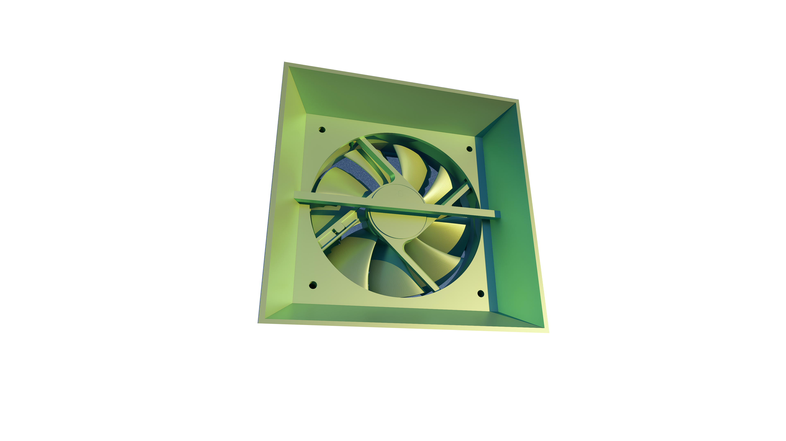
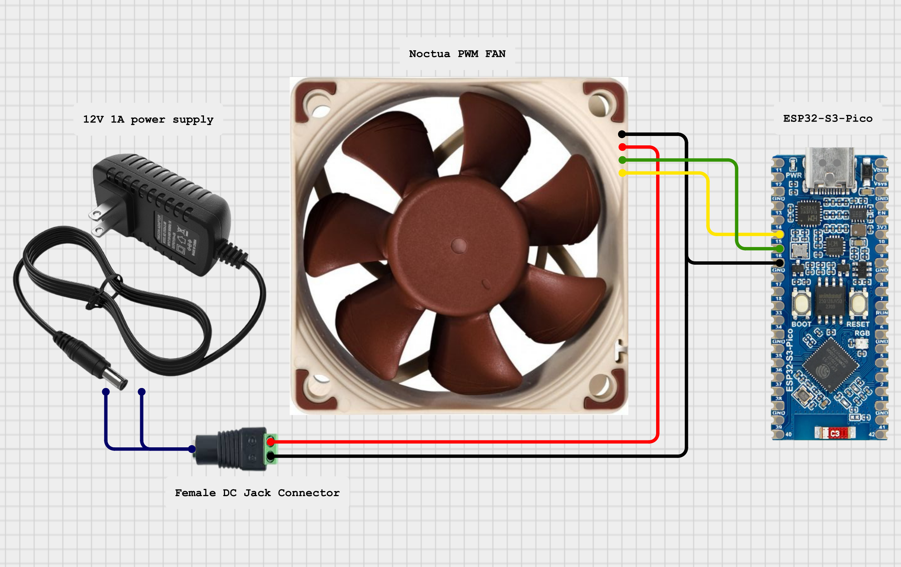
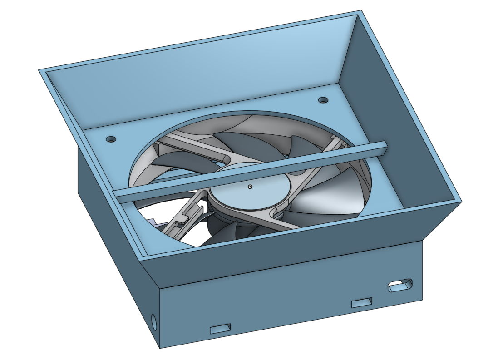

# Fume-Extractor !!

a device made to extract solder fumes as efficiently and as quietly as possible

i made this project because i kept breathing in soldering fumes which was probably making me lose braincells, and i now want to avoid this (also i need to learn how to cad and this is a very simple project to learn more cad)

it uses a noctua fan, and an esp32s3 to control it, and is powered by a 12v barrel power source. the case is 3d printed.

## Wiring diagram:

## CAD: https://cad.onshape.com/documents/a80b4d4af3d5718c159f3428/w/04668cddc08b6ee75e163b3f/e/2fbe059b941e165c6cd4dcd1?renderMode=0&uiState=6a126e6f2b809c76643f81a4

## Assembly instructions:
1. 3d-print the fan case
2. Place the noctua fan in the slot
3. use heat-set inserts to screw in the fan to the case
4. connect the adapter screw termins into the fan according to the wiring diagram
5. solder a wire onto the remaining fan pins to the devboard
6. plug a barrel jack power supply into adapter
7. upload firmware to devboard
8. place the adapter and devboard at the back, and close it with the solid plate

## BOM:

|Item                                    |Link                                                                                              |Price (CAD)|
|----------------------------------------|--------------------------------------------------------------------------------------------------|-----------|
|Noctua NF-P12 redux-1700 PWM            |https://www.amazon.ca/redux-1700-high-Performance-heatsinks-Award-Winning-Affordable/dp/B07CG2PGY6|24.80      |
|22 AWG Solidcore Wire                   |https://www.aliexpress.com/item/1005011689408463.html                                             |5.99       |
|ESP32 S3 Devboard                       |https://www.aliexpress.com/item/1005007319706057.htmll                                            |           |
|12V Barrel Female Screw Terminal Adapter|https://www.aliexpress.com/item/1005005390049303.html                                             |3.07       |
|Carbon Filter                           |https://www.aliexpress.com/item/1005010184891978.html                                             |9.68       |
|12V 1A Barrel Power Source              |https://www.aliexpress.com/item/1005010390772322.html                                             |           |
|                                        |                                                                                                  |           |
|                                        |Total (USD, after tax):                                                                           |31.35      |
